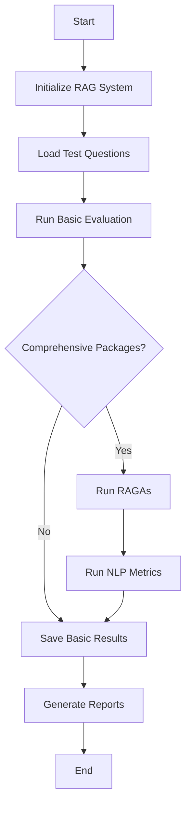

# RAG Agent Evaluation Guide

## Overview

Quick Guide — Evaluate with OpenAI

Follow these minimal steps to evaluate the agent using an OpenAI API key (PowerShell examples):

- Set OpenAI environment variables for the current session:

```powershell
$env:OPENAI_API_KEY = "sk-..."
$env:OPENAI_MODEL = "gpt-3.5-turbo"  # or gpt-4 if available
$env:LLM_PROVIDER = "openai"
```

- (Optional) Install comprehensive evaluation dependencies if you want RAGAs / BLEU / ROUGE / BERTScore:

```powershell
pip install ragas nltk rouge-score bert-score datasets scikit-learn
```

- Run the evaluator (basic evaluation always runs; comprehensive runs if deps and OPENAI_API_KEY present):

```powershell
python evaluate_agent.py
```

Notes:

- RAGAs requires `OPENAI_API_KEY` (it uses OpenAI for embeddings/judging). If the key is missing, RAGAs will be skipped and a warning printed.
- Set `LLM_PROVIDER=openai` to force the agent to use OpenAI for LLM calls.
- Results are saved under `evaluation_results/` (basic and comprehensive JSON files).

See the full sections below for customization, test set creation, and troubleshooting.

This RAG Agent includes two evaluation modes:

1. **Basic Evaluation** (LLM-as-Judge) - No extra dependencies required
2. **Comprehensive Evaluation** (RAGAs + NLP Metrics) - Requires additional packages

## Evaluation Metrics

### Basic Evaluation (Always Available)

- **Answer Quality**: LLM judges answer correctness (1-5 scale)
- **Answer Relevance**: LLM judges relevance to question (1-5 scale)
- **Source Accuracy**: Checks if sources are used correctly
- **Response Time**: Measures query processing time
- **Context Quality**: LLM evaluates retrieved context quality

### Comprehensive Evaluation (Optional)

#### RAGAs Metrics

- **Faithfulness**: How grounded is the answer in retrieved context?
- **Answer Relevancy**: How relevant is the answer to the question?
- **Context Relevancy**: How relevant are retrieved contexts?
- **Context Recall**: Coverage of ground truth in retrieved contexts
- **Context Precision**: Ranking quality of retrieved contexts
- **Answer Similarity**: Semantic similarity to ground truth
- **Answer Correctness**: Combined semantic + factual correctness

#### NLP Metrics

- **BLEU-1/2/4**: N-gram overlap scores (translation quality)
- **ROUGE-1/2/L**: Recall-Oriented Understudy for Gisting Evaluation
- **BERTScore**: Contextual embedding-based similarity
  - Precision
  - Recall
  - F1 Score

#### Custom Metrics

- **Answer Length**: Character count
- **Context Usage Rate**: Percentage of contexts used in answer

## Installation

### Basic Evaluation (Default)

No extra installation needed. Uses existing dependencies.

```bash
python evaluate_agent.py
```

### Comprehensive Evaluation

Install additional packages:

```bash
pip install -r requirements-eval.txt
```

Or install individually:

```bash
pip install ragas nltk rouge-score bert-score datasets scikit-learn
```

## Running Evaluation

### Quick Start

```bash
python evaluate_agent.py
```

This will:

1. Initialize RAG system with NVIDIA embeddings
2. Load test questions
3. Run basic evaluation (always)
4. Run comprehensive evaluation (if packages available)
5. Save results to `evaluation_results/` directory

### Output Files

- `evaluation_TIMESTAMP.json` - Basic evaluation results
- `summary_TIMESTAMP.json` - Evaluation summary
- `comprehensive_eval_TIMESTAMP.json` - RAGAs + NLP metrics (if available)

## Creating Test Sets

Edit `create_test_set()` in `evaluate_agent.py`:

```python
def create_test_set() -> List[Dict]:
    return [
        {
            "question": "Your test question?",
            "expected_answer": "Ground truth answer",  # Optional for NLP metrics
            "category": "factual",
            "difficulty": "medium"
        },
        # Add more questions...
    ]
```

### Test Question Categories

- `factual`: Requires specific facts from documents
- `conceptual`: Requires understanding and explanation
- `comparative`: Requires comparing concepts
- `procedural`: How-to questions

### Difficulty Levels

- `easy`: Direct fact retrieval
- `medium`: Some reasoning required
- `hard`: Complex multi-step reasoning

## Customizing Evaluation

### Modify Evaluation Criteria

In `src/evaluation_metrics.py`, adjust `RAGEvaluator` parameters:

```python
evaluator = RAGEvaluator(
    use_ragas=True,          # Enable/disable RAGAs
    use_nlp_metrics=True,    # Enable/disable BLEU/ROUGE/BERTScore
    ragas_metrics=['faithfulness', 'answer_relevancy']  # Select specific RAGAs metrics
)
```

### Change Number of Test Cases

In `evaluate_agent.py`, modify:

```python
for test_q in test_questions[:5]:  # Change 5 to desired number
```

## Interpreting Results

### Score Ranges

**LLM-as-Judge (1-5 scale)**

- 5: Excellent
- 4: Good
- 3: Adequate
- 2: Poor
- 1: Very Poor

**RAGAs Metrics (0-1 scale)**

- 0.8-1.0: Excellent
- 0.6-0.8: Good
- 0.4-0.6: Fair
- 0.0-0.4: Needs Improvement

**BLEU/ROUGE (0-1 scale)**

- 0.5+: Good overlap
- 0.3-0.5: Moderate overlap
- 0.0-0.3: Low overlap

**BERTScore (0-1 scale)**

- 0.9+: Very high similarity
- 0.8-0.9: High similarity
- 0.7-0.8: Moderate similarity
- <0.7: Low similarity

## Troubleshooting

### Issue: "Module not found" errors

**Solution**: Install evaluation dependencies

```bash
pip install -r requirements-eval.txt
```

### Issue: RAGAs evaluation slow

**Solution**:

- Reduce test set size (use fewer questions)
- RAGAs uses LLM calls, so it takes time
- Consider evaluating only critical questions

### Issue: BERTScore requires large model download

**Solution**:

- First run downloads BERT model (~400MB)
- Subsequent runs use cached model
- Use `--no-cache` if disk space is limited

### Issue: NLTK data not found

**Solution**:

```python
import nltk
nltk.download('punkt')
nltk.download('wordnet')
```

## Best Practices

1. **Test Set Quality**: Use diverse, representative questions
2. **Ground Truth**: Provide expected answers for NLP metrics
3. **Batch Size**: Start with 5-10 questions, expand gradually
4. **Metric Selection**: Choose metrics relevant to your use case
5. **Regular Evaluation**: Run after significant changes
6. **Version Control**: Track evaluation results over time

## Evaluation Workflow



## Example Output

```
================================================================================
RAG AGENT EVALUATION
================================================================================

1. Initializing RAG system...
2. Setting up knowledge base...
3. Initializing agent...
4. Creating evaluator...
5. Loading test questions...
   Loaded 10 test questions

6. Running evaluation...
   ✓ Question 1/10: What is RAG?
   ✓ Question 2/10: How does retrieval work?
   ...

================================================================================
EVALUATION SUMMARY
================================================================================

Overall Statistics:
  Questions Evaluated: 10
  Average Answer Quality: 4.2/5.0
  Average Answer Relevance: 4.5/5.0
  Average Response Time: 2.3s

7. Running comprehensive RAG evaluation...
   ✓ RAGAs: Faithfulness: 0.85
   ✓ RAGAs: Answer Relevancy: 0.90
   ✓ BLEU-4: 0.62
   ✓ ROUGE-L: 0.71
   ✓ BERTScore F1: 0.88

✓ Full results saved to: evaluation_results/evaluation_20240115_143022.json
✓ Comprehensive results saved to: evaluation_results/comprehensive_eval_20240115_143022.json

Evaluation complete!
```

## Advanced Usage

### Batch Evaluation Script

```python
from src.evaluation_metrics import RAGEvaluator

evaluator = RAGEvaluator(use_ragas=True)

test_cases = [
    {
        'question': '...',
        'answer': '...',
        'contexts': [...],
        'ground_truth': '...'
    }
]

results = evaluator.evaluate_batch(test_cases)
evaluator.print_results(results)
```

### Custom Metric Addition

Add your own metrics in `src/evaluation_metrics.py`:

```python
def custom_metric(self, question: str, answer: str, contexts: List[str]) -> float:
    # Your evaluation logic
    score = ...
    return score
```

## API Reference

See `src/evaluation_metrics.py` for full API documentation:

- `RAGEvaluator` class
- `evaluate_batch()` method
- `evaluate_with_ragas()` method
- `evaluate_with_nlp_metrics()` method

## Performance Considerations

- **RAGAs**: ~5-10s per question (uses LLM)
- **NLP Metrics**: ~0.5-1s per question
- **BERTScore**: First run downloads model
- **Recommendation**: Start with 5 questions, scale up

## Integration with CI/CD

```yaml
# Example GitHub Actions
name: Evaluate RAG Agent
on: [push]
jobs:
  evaluate:
    runs-on: ubuntu-latest
    steps:
      - uses: actions/checkout@v2
      - name: Install dependencies
        run: |
          pip install -r requirements.txt
          pip install -r requirements-eval.txt
      - name: Run evaluation
        run: python evaluate_agent.py
      - name: Upload results
        uses: actions/upload-artifact@v2
        with:
          name: evaluation-results
          path: evaluation_results/
```

## Support

For issues or questions:

1. Check troubleshooting section
2. Review RAGAs documentation: https://docs.ragas.io
3. Review evaluation code in `src/evaluation_metrics.py`
